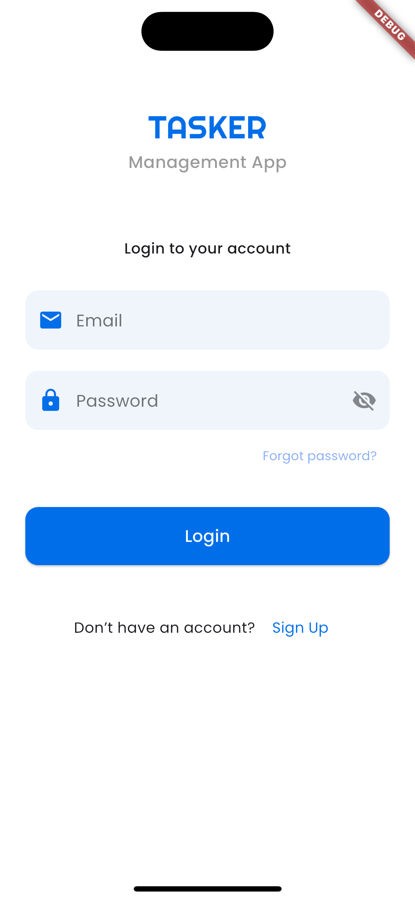
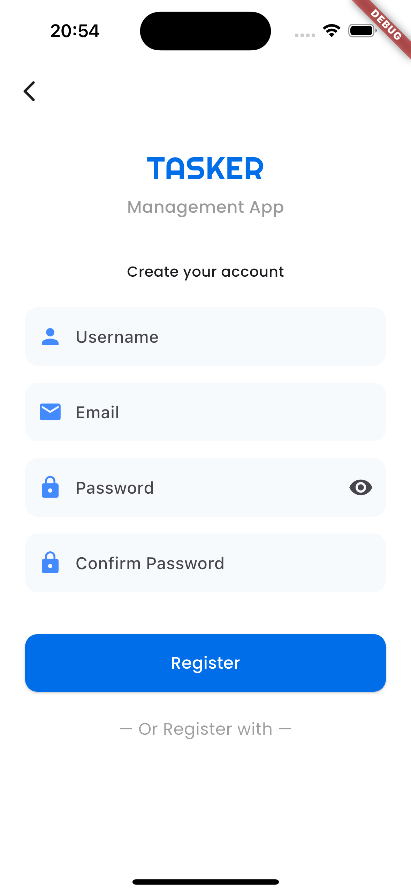
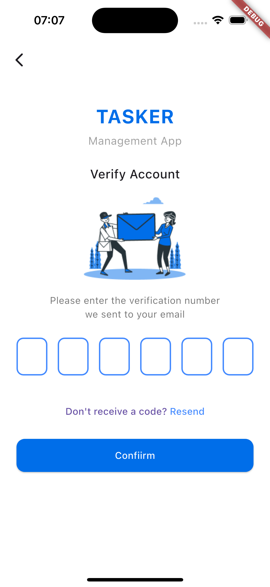
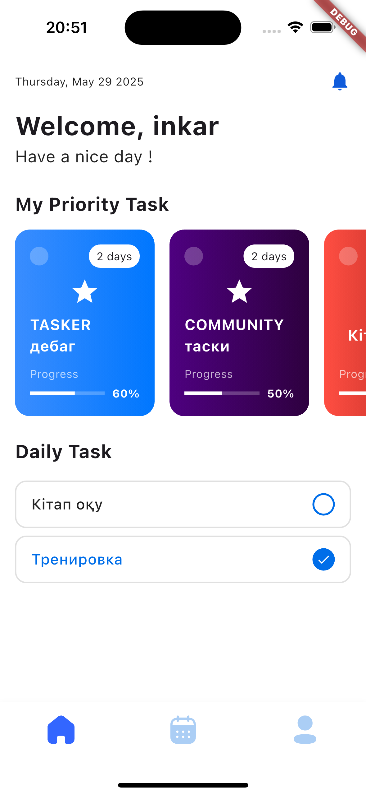
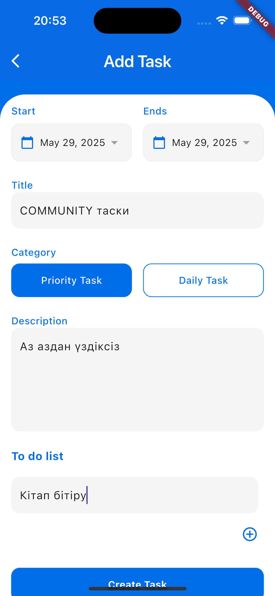
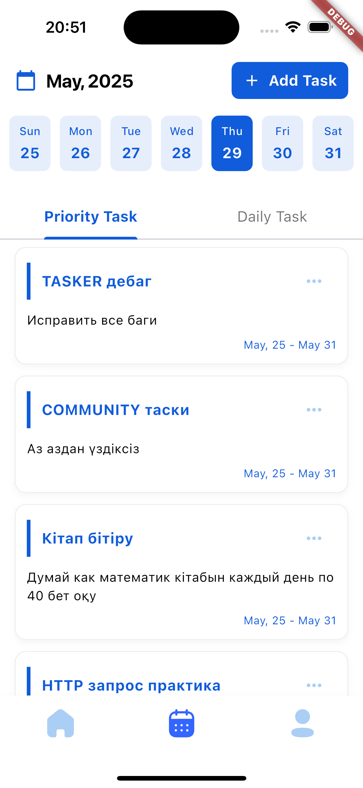
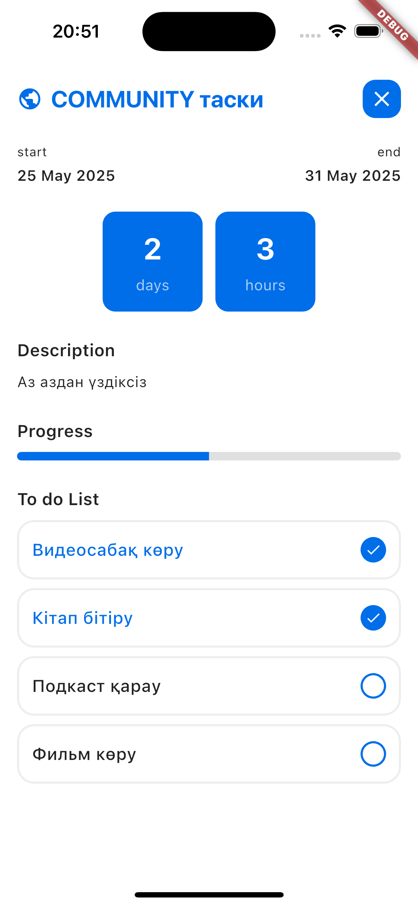
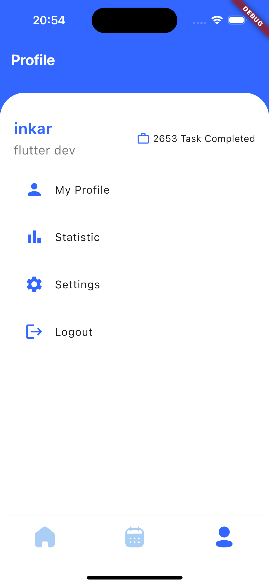

# 📝 Tasker App — Умный трекер задач с поддержкой календаря

🚀 **Описание**  
Tasker — это кроссплатформенное мобильное приложение для управления повседневными задачами.  
Поддерживает создание приоритетных и ежедневных задач с подзадачами, редактированием, отслеживанием выполнения и привязкой к календарю.

Разработано с применением **чистой архитектуры**, Bloc для управления состоянием, Drift (SQLite) для локального хранения, Firebase Auth для аутентификации.

---

## 📸 Скрины

<table>
  <tr>
    <td align="center"><strong>🔐 Вход</strong></td>
    <td align="center"><strong>📝 Регистрация</strong></td>
    <td align="center"><strong>📝 Верификация</strong></td>
    <td align="center"><strong>🏠 Главный экран</strong></td>
  </tr>
  <tr>
    <td></td>
    <td></td>
    <td></td>
    <td></td>
  </tr>
  <tr>
    <td align="center"><strong>➕ Добавление задачи</strong></td>
    <td align="center"><strong>✅ Список задач</strong></td>
    <td align="center"><strong>📋 Детали задачи</strong></td>
    <td align="center"><strong>👤 Профиль</strong></td>
  </tr>
  <tr>
    <td></td>
    <td></td>
    <td></td>
    <td></td>
  </tr>
</table>


---

## 🔧 Стек технологий  
- 🐦 Flutter/Dart  
- 🧱 Clean Architecture  
- 🧠 Bloc
- 🗂 Drift (SQLite)  
- ☁️ Firebase Authentication  

---

## 💡 Основной функционал  
- Создание задач: ежедневные и приоритетные  
- Управление подзадачами с сохранением состояния
- Выбор времени начала и окончания задачи  
- Календарь с отображением задач по дням  
- Редактирование и удаление задач  
- Поддержка оффлайн-режима с локальной базой данных  
- Интуитивно понятный и отзывчивый UI  

---

## 🧠 Архитектура  
- `data` — локальный и удалённый источники данных, модели и мапперы  
- `domain` — use cases и бизнес-логика  
- `presentation` — UI + Bloc с состояниями и событиями  

Все зависимости внедряются через **GetIt**, соблюдая принципы **SOLID**.

---

## 🔐 Аутентификация  
- Firebase Auth  
- Вход с OTP по email  
- Поддержка текущих сессий  
- Валидация входных данных  

---

## 📦 Установка  
```bash
git clone https://github.com/inkartk/tasker_app.git  
cd tasker_app  
flutter pub get  
flutter run
```

---

## 🧪 В планах

- Поддержка уведомлений  
- Темизация (светлая/тёмная тема)  
- Синхронизация с Google Calendar
- Cloud Firestore как альтернатива локальной БД  

---

## 👩‍💻 Обо мне

Я — Junior Flutter Developer, стремящийся к качественной архитектуре, масштабируемому коду и продуктивному UI/UX.  
В этом проекте я продемонстрировал(а) **реальный продакшн-подход**, как на коммерческой разработке: от структуры проекта до соблюдения лучших практик Flutter-разработки.


